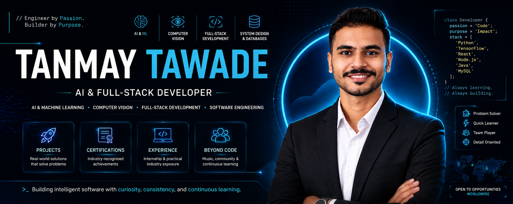

<p align="center">
  <a href="https://portfolio-tanmay-tawade.vercel.app/">
    
  </a>
</p>

<p align="center">
  
</p>

<h1 align="center">TanmayT. - Personal Portfolio</h1>

<p align="center">
  <strong>AI & Full-Stack Developer • Computer Vision • Software Engineering</strong>
</p>

<p align="center">
  A personal portfolio website showcasing my projects, technical skills, certifications, experience, and the ideas that shape how I build software.
</p>

<p align="center">
  <a href="https://portfolio-tanmay-tawade.vercel.app/">
    
  </a>
  <a href="https://github.com/TanmayT134/portfolio">
    
  </a>
</p>

<p align="center">


</p>

---

# ✦ About This Portfolio

This repository contains my personal developer portfolio — a digital space where I present **what I build, what I have learned, and how I approach software development**.

The portfolio is designed around a simple idea:

> **Build meaningful software. Learn continuously. Explain what you build.**

Rather than functioning as a simple resume website, the portfolio brings together my work across:

- 🤖 Artificial Intelligence & Machine Learning
- 👁️ Computer Vision & Explainable AI
- 🌐 Full-Stack Web Development
- ☕ Java Software Engineering
- 🗄️ Database-Driven Applications
- 🧩 System Design & Engineering Fundamentals
- 📚 Certifications & Continuous Learning
- 🎵 Interests and experiences beyond technology

The website is intentionally built as a **static, lightweight application** without a frontend framework or backend dependency.

---

# 🌐 Live Portfolio

<p align="center">
  <a href="https://portfolio-tanmay-tawade.vercel.app/">
    
  </a>
</p>

<p align="center">
  <strong>https://portfolio-tanmay-tawade.vercel.app/</strong>
</p>

---

# ✨ What Makes It Different

The portfolio is designed to feel more like a **personal product experience** than a traditional resume page.

### 🎬 Interactive Experience

- Animated page loading experience
- Smooth scrolling navigation
- Scroll-based reveal animations
- Custom cursor interactions on desktop
- Magnetic hover interactions
- Interactive project case-study modals
- Interactive certification detail modals
- Interactive "Beyond Code" story modals

### 🌓 Theme System

- Dark theme by default
- Light theme support
- Theme preference stored locally
- Dynamic browser theme color
- Accessible theme toggle

### 📱 Responsive Design

The interface is designed to adapt across:

- Desktop
- Laptop
- Tablet
- Mobile devices

The navigation automatically switches to a mobile menu on smaller screens.

### ♿ Accessibility & UX

The project also considers user experience through:

- Semantic HTML structure
- Accessible navigation controls
- ARIA attributes for interactive components
- Reduced-motion support
- Responsive typography
- Keyboard-friendly interactions
- Clear visual hierarchy

---

# 🧭 Portfolio Structure

The website is organized into focused sections that represent different parts of my professional journey.

| Section | Purpose |
|:--|:--|
| 🏠 **Home** | Introduction, positioning and primary call-to-actions |
| 👨‍💻 **About** | Background, development philosophy and current focus |
| 🛠️ **Skills** | Technical stack and engineering fundamentals |
| 🚀 **Projects** | Selected projects with detailed case studies |
| 📜 **Certifications** | Verified learning credentials |
| 💼 **Experience** | Internship and professional development |
| 🎵 **Beyond Code** | Music, community involvement and continuous learning |
| 🤝 **Contact** | Contact form and professional links |

---

# 🚀 Featured Projects

The portfolio currently highlights four projects representing different areas of software development.

<table>
<tr>

<td width="50%" valign="top">

## 🧠 Explainable Brain Tumor Detection

A CNN-based medical imaging system designed to classify brain MRI scans into tumor categories while using **Grad-CAM** to make model predictions more interpretable.

**Focus**

- Deep Learning
- Medical Image Classification
- Explainable AI
- Computer Vision
- Streamlit

**Technologies**

`Python` `TensorFlow` `OpenCV` `Scikit-learn` `Grad-CAM` `Streamlit`

</td>

<td width="50%" valign="top">

## 🛡️ DeepShield

An end-to-end deepfake detection platform that analyzes video content using computer vision and deep learning to distinguish real media from AI-generated content.

**Focus**

- Deepfake Detection
- Computer Vision
- EfficientNetB0
- MTCNN
- Video Analysis

**Technologies**

`Python` `TensorFlow` `OpenCV` `EfficientNetB0` `MTCNN` `Streamlit`

</td>

</tr>

<tr>

<td width="50%" valign="top">

## 🏨 EZStay

A full-stack accommodation booking platform featuring authentication, role-based authorization, property management, REST APIs and database-backed persistence.

**Focus**

- Full-Stack Development
- REST APIs
- Authentication
- Database Design
- Web Applications

**Technologies**

`React` `Node.js` `Express.js` `MySQL` `JWT` `Bootstrap`

</td>

<td width="50%" valign="top">

## 🏦 ATM Simulation System

A Java Swing banking application simulating authentication, account operations, transactions and persistent data management through JDBC and MySQL.

**Focus**

- Java
- Object-Oriented Programming
- Desktop Applications
- JDBC
- Database Integration

**Technologies**

`Java` `Swing` `JDBC` `MySQL` `OOP`

</td>

</tr>
</table>

<p align="center">
  <a href="https://github.com/TanmayT134?tab=repositories">
    
  </a>
</p>

---

# 💻 Technical Stack

The portfolio represents a practical technology stack developed through projects, coursework, internships and continuous experimentation.

## 🤖 Artificial Intelligence & Machine Learning

<p>


</p>

---

## 🌐 Frontend Development

<p>


</p>

---

## ⚙️ Backend & APIs

<p>


</p>

---

## 🗄️ Databases

<p>


</p>

---

## 🛠️ Development Tools

<p>


</p>

---

## ☁️ Deployment

<p>


</p>

---

# 📜 Certifications

The portfolio includes dedicated certification cards with detailed information and credential links.

| Certification | Issuer | Status |
|:--|:--|:--:|
| 🧠 Fundamentals of Deep Learning | NVIDIA Deep Learning Institute | ✅ Verified |
| ☁️ AWS Cloud Quest: Cloud Practitioner | Amazon Web Services | ✅ Verified |
| 🍃 Introduction to MongoDB | MongoDB University | ✅ Verified |
| 🌐 Web Development Training | Internshala | ✅ Completed |

Each certification can be explored directly through the interactive portfolio interface.

---

# 💼 Experience

### Web Development Internship
**TechOctanet Services Pvt. Ltd.**  
**February — March 2025**

During the internship, I worked on:

- Responsive web page development
- HTML and CSS
- Bootstrap
- JavaScript
- CRUD-based task management functionality
- DOM manipulation
- Git and GitHub version control

### Personal Development
**2025 — Present**

Continuously building increasingly complex projects across:

- Artificial Intelligence
- Computer Vision
- Full-Stack Development
- Java Software Engineering
- Databases
- System Design

---

# 🎵 Beyond Code

The portfolio intentionally includes a section beyond traditional technical information.

### 🥁 Tabla Visharad

Years of disciplined Tabla practice have strengthened my:

- Discipline
- Patience
- Consistency
- Rhythm
- Focus on fundamentals

### 🤝 Community

As a member of **Shrimant Bhausaheb Rangari Ganpati Trust, Pune**, community participation and service are an important part of my experience beyond software development.

### 📚 Continuous Learning

I believe development is a continuous process.

I regularly explore:

- New technologies
- Software engineering practices
- System design
- Artificial Intelligence
- Better development workflows

---

# 🎨 Design Philosophy

The visual language of the portfolio is intentionally built around a **dark, minimal and technical aesthetic**.

### Visual Principles

- Dark-first interface
- Cyan accent color
- Strong typography
- High visual contrast
- Spacious layouts
- Minimal but expressive motion
- Rounded interface elements
- Structured information hierarchy
- Subtle gradients and glow effects

The goal is to keep the interface **professional without making it feel generic**.

---

# ⚡ Interactive Features

The website includes several custom interactions implemented without external UI frameworks.

| Feature | Implementation |
|:--|:--|
| 🌓 Theme Switching | JavaScript + Local Storage |
| 🧭 Smooth Navigation | Custom JavaScript scrolling |
| 📍 Active Navigation | Intersection Observer |
| ✨ Scroll Reveals | Intersection Observer |
| 🖱️ Custom Cursor | JavaScript |
| 🧲 Magnetic Elements | Mouse-based interaction |
| 📊 Page Progress | Scroll-based progress indicator |
| 📱 Mobile Navigation | Responsive JavaScript menu |
| 🧠 Project Modals | Custom JavaScript modal system |
| 📜 Certification Modals | Custom JavaScript modal system |
| 🎵 Story Modals | Custom JavaScript modal system |
| ⏳ Page Loader | Custom loading/progress animation |
| ♿ Reduced Motion | `prefers-reduced-motion` support |

---

# 🔎 SEO & Discoverability

The portfolio includes several SEO and social-sharing optimizations.

### Included

- Search engine metadata
- Canonical URL
- Open Graph metadata
- Twitter Card metadata
- JSON-LD structured data
- `robots.txt`
- XML sitemap
- Web manifest
- Favicon
- Social preview image
- Descriptive page metadata

### Canonical Website

```text
https://portfolio-tanmay-tawade.vercel.app/

### Sitemap

```text
https://portfolio-tanmay-tawade.vercel.app/sitemap.xml
```

### Robots

```text
https://portfolio-tanmay-tawade.vercel.app/robots.txt
```

---

# 📸 Professional Photo

The portfolio supports a professional profile image.

Place your photo at:

```text
assets/profile.jpg
```

The website is designed to safely fall back to:

```text
assets/profile-placeholder.svg
```

if the real profile image is not available.

### Recommended Photo

A suitable image should ideally be:

- 🧑 Portrait-oriented
- 💡 Well-lit
- 👔 Professional
- 🖼️ High-resolution
- 📁 JPG or WebP

---

# 📂 Project Structure

```text
portfolio/
│
├── assets/
│   ├── favicon.svg
│   ├── og-cover.svg
│   ├── profile-placeholder.svg
│   ├── Profile.png
│   └── Tanmay_Pramod_Tawade_Resume.pdf
│
├── css/
│   └── style.css
│
├── js/
│   └── main.js
│
├── index.html
│
├── robots.txt
├── sitemap.xml
├── site.webmanifest
│
└── README.md
```

---

# 🧩 Architecture

The project follows a lightweight static architecture:

```text
                    ┌──────────────────────┐
                    │      index.html      │
                    │   Portfolio Content  │
                    └──────────┬───────────┘
                               │
                 ┌─────────────┴─────────────┐
                 │                           │
        ┌────────▼────────┐        ┌────────▼────────┐
        │     style.css   │        │     main.js     │
        │  Visual System  │        │  Interactions   │
        └─────────────────┘        └─────────────────┘
                 │                           │
                 └─────────────┬─────────────┘
                               │
                     ┌─────────▼─────────┐
                     │      Assets       │
                     │ Images / SVG /    │
                     │ Resume / Metadata │
                     └───────────────────┘
```

There is no backend server or database required for the portfolio itself.

---

# 🛠️ Local Development

Because this is a static HTML/CSS/JavaScript project, there is **no package manager or dependency installation required**.

## 1️⃣ Clone the Repository

```bash
git clone https://github.com/TanmayT134/portfolio.git
```

## 2️⃣ Enter the Project Directory

```bash
cd portfolio
```

## 3️⃣ Run Locally

You can open `index.html` directly in a browser.

For a more realistic local development environment, use a static server.

### VS Code

Install the **Live Server** extension and open:

```text
index.html
```

Then select:

```text
Open with Live Server
```

The portfolio will be available through the local development server.

---

# 🚀 Deployment

The project is deployed using **Vercel** as a static website.

No build process or server-side runtime is required.

### Deployment Flow

```text
GitHub Repository
       │
       ▼
     Vercel
       │
       ▼
Static HTML / CSS / JavaScript
       │
       ▼
 Live Portfolio
```

### Live Website

<p align="center">
  <a href="https://portfolio-tanmay-tawade.vercel.app/">
    
  </a>
</p>

---

# 🔄 Continuous Development

This portfolio is not intended to be a finished static document.

It evolves alongside my development journey.

As I build new applications, gain experience, learn technologies and improve my engineering skills, the portfolio is updated to reflect that progress.

Future improvements may include:

- ✨ New interactive experiences
- 🎬 Refined animations
- 📱 Further mobile optimization
- ⚡ Performance improvements
- 🎨 Continued UI/UX refinement
- 🧠 Additional AI project showcases
- 🚀 New project demonstrations
- 🧩 More detailed project case studies

---

# 🌱 Currently Exploring

My current learning and development interests include:

- 🧠 Explainable Artificial Intelligence
- 🤖 Deep Learning & Computer Vision
- 🌐 Full-Stack Application Development
- 📱 React Native & Mobile Development
- ☁️ AI Application Deployment
- 🧩 System Design
- ⚡ Production-Ready Software Engineering

---

# 🤝 Open To

I'm interested in opportunities where I can contribute, learn, and grow while working on meaningful software.

- 🤖 Machine Learning & AI Engineering
- 🧠 Computer Vision & Explainable AI
- 🌐 Full-Stack Development
- 📱 Application Development
- 🚀 Software Engineering
- 🤝 Open Source Collaboration

---

# 👨‍💻 Developer

**Tanmay Tawade**

### Connect

<p>

<a href="https://github.com/TanmayT134">

</a>

<a href="https://www.linkedin.com/in/tanmay-tawade-995829344/">

</a>

<a href="https://portfolio-tanmay-tawade.vercel.app/">

</a>

<a href="https://dev.to/tanmayt134">

</a>

</p>

---

# ⭐ Support

If you find the project useful or interesting:

- ⭐ Star the repository
- 🍴 Fork the project
- 💬 Share feedback or suggestions
- 🛠️ Contribute improvements
- 🤝 Connect for collaboration

---

<div align="center">

## ⭐ If you found this project useful, please consider giving it a Star!

It helps support the project and encourages further development.

<br>

Made with ❤️ by **Tanmay Tawade**

</div>
